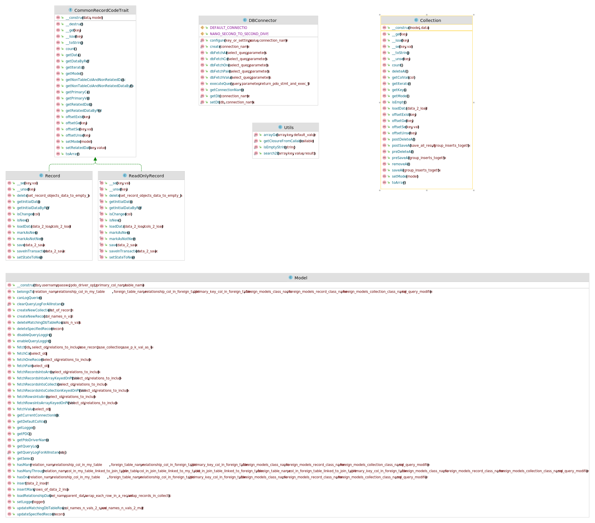

 &nbsp; 
 &nbsp; 
 &nbsp; 
 &nbsp; 
 &nbsp; 
 &nbsp; 
 &nbsp; 
 &nbsp; 
 &nbsp; 
 &nbsp; 
 &nbsp; 

##### A Generic Data Objects ( https://github.com/rotexsoft/gdao ) implementation based on a stripped down version of idiorm (\\LeanOrm\\DBConnector). A light-weight, highly performant PHP data access library. 

See http://rotexsoft.github.io/leanorm/ for documentation.

## Dev Notes

 * Old versions have branches corresponding to their version numbers (e.g. 1.X) 
while the most current / actively being developed version is on the master branch

## Concepts

Courtesy of https://www.semicolonandsons.com/code_diary/databases/difference-between-has-one-belongs-to-and-has-many

### Difference between has one belongs to and has many

This is part of the Semicolon&Sons [Code Diary](https://www.semicolonandsons.com/code_diary) - consisting of lessons learned on the job. You're in the [databases](https://www.semicolonandsons.com/code_diary/databases) category.

The only difference between `hasOne` and `belongsTo` is where the foreign key column is located.

Let's say you have two entities: User and an Account.

-   If the users table has the `account_id` column then a User `belongsTo` Account. (And the Account either `hasOne` or `hasMany` Users)
    
-   But if the users table does _not have_ the `account_id` column, and instead the accounts table has the `user_id` column, then User `hasOne` or `hasMany` Accounts
    

In short `hasOne` and `belongsTo` are inverses of one another - if one record `belongTo` the other, the other `hasOne` of the first. Or, more accurately, eiterh `hasOne` or `hasMany` - depending on how many times its id appears.

### Fetching data

If you want to grab related data always specify the name(s) of the relations whose data you want to grab during a fetch so that there are
only 1 + n queries issued to retrieve data where n is the number of relations you want to get data for, or else the package will issue 
an extra query for each relation whose data you want to access for each record.

For example if you had 3 authors & a total of 10 Blog Posts from all the authors, when you fetch all the author records, if you do not
specify that you want all Blog Posts at the time you are calling the fetch method, then only one query to select * from authors will
be issued when fetch is called, but when you start looping through the author records to access the posts for each author 3 extra queries
in the for of select * from blog_posts where author_id  = current_authors_id to get the blog posts for each author while looping meaning that
4 queries in total will be issued in this scenario (assuming the 3 authors have the ids 1, 2 & 3):

1. select * from authors
2. select * from blog_posts where author_id = 1
3. select * from blog_posts where author_id = 2
4. select * from blog_posts where author_id = 3

If you specify that you want to fetch blog posts at the time you are calling the fetch method, then only two queries will be issued

A. select * from authors

B. select * from blog_posts where author_id IN ( select distinct id from authors ) // The result of this query will be stitched into the 
                                                                                   // appropriate author records from the query A above.
